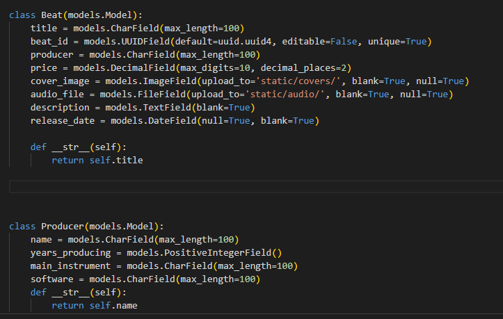
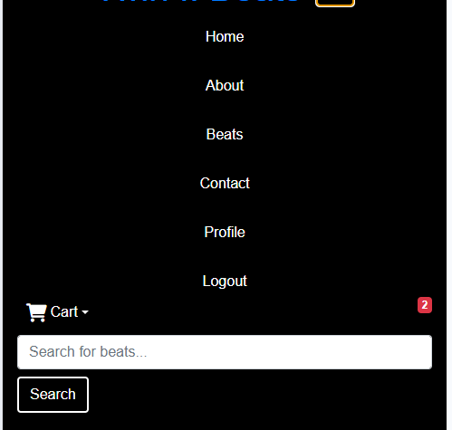
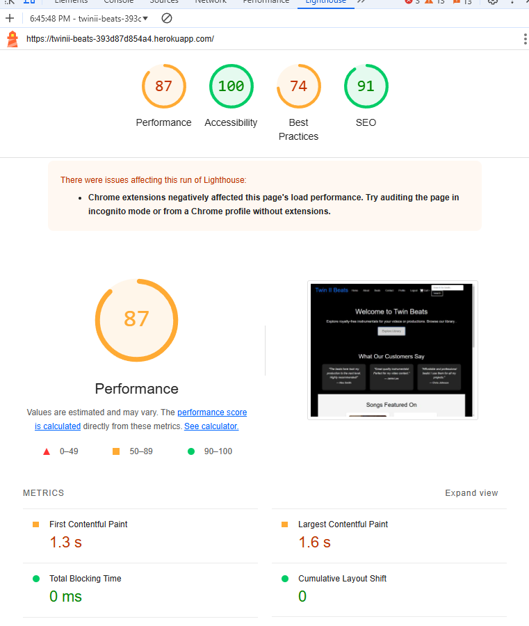

# Beats
Website is a dynamic web application that allows users to purchase high-quality beats from talented producers. The platform provides a seamless user experience, enabling visitors to explore producer profiles, listen to beats, and purchase them securely using Stripe. Users can also view producer information such as years of experience, primary instruments, and software used. The website is designed to cater to artists, content creators, and businesses looking for unique music production solutions by purchasing royalty free beats.

# Rationale 
The "Beats" website is designed to sell royalty free songs and instrumentals to producers of modern digital media. It provides a space for users to buy music.

## Key Features and Their Rationales

### User Authentication and Access Control
#### Registration & Login: 
Users can register and log in to access member-only features like purchasing beats, viewing profiles, and saving orders.

#### Profile Management: 
Users can edit their personal information and manage purchases through their profiles.

### Producer Profiles
Producer Information: Displays producer bio, skills, and equipment, such as software and hardware used.

Producer Cards: Each producer has a dedicated card on the "Our Producers" section, showcasing:Name, Years of production experience, Main instrument, Software expertise

### Beat Marketplace 
#### Browse Beats:
Users can browse beats and listen to previews.

### uploading bar for uploading audio superusers

#### Search & Filter: 
Users can search for beats by Price, title or producer.

### E-commerce (Powered by Stripe)
#### Secure Payments: 
Integration with Stripe ensures secure payments for beat purchases.

#### Order History:
 Users can view their purchase history from their profiles.

#### Instant Beat Download:
 After successful payment, users can download the purchased beats directly.

### Custom Beat Requests
Users can request customized beats from producers by filling out a contact form.
Producers can receive and respond to user requests via email.

### confirmation email
Users can keep track of thier orders and download from external link 

# Beat Model

The Beat model represents individual music beats that can be listed, purchased, or streamed. It includes details like the beat's title, producer, price, and associated media files.

## Features

#### UUID for Unique Identification:
 Each beat is assigned a globally unique identifier (UUID) to ensure uniqueness and make URLs less predictable.

#### File Uploads:
 Supports uploading of both a cover image and an audio file. These files are stored in the static/covers/ and static/audio/ directories, respectively.

#### String Representation:
 The str method returns the title of the beat, making it easier to identify beats in the Django admin and other interfaces

 ## The Producer model 
 represents music producers who create beats. It tracks details about their experience, primary instruments, and preferred software.

 ### Years of Experience: 
 Tracks how long the producer has been creating music using a PositiveIntegerField.

### Software & Instrument Info:
 Provides insight into the producer's tools of the trade.

# User Stories
The purpose of Gig reviews is to let users display their thoughts on the musicians they have seen recently and to see any other reviews about gigs they maybe interesed in from other users

### User Goals
* To buy royalty free music
* To have a platform to purchase music for a fixed price with no royalty confusion
* To purchase music, using online payments
* To have the option to listen to the music before they purchase
* to use thier credit or debit card to purchase music
* to have the option to come back and redownload songs

### Site Owner goals 

* To make a website where the site owner can upload own music for free and sell to the public
* Make a fully functioning online shop, where users can preview and purchase instrumentals
* Ensure that only logged-in users can buy instrumentals.
* Make a database where when users have stored their information it can be seen from the admin panel for the admin 
* To give the option for users to remove themselves off the database
* To see the amount of orders and order details on the admin panel 
* To keep track of payments using stripe 

# UX Design

For the colour scheme I have gone with a dark colour with white text, I think it looks more professional

# Data Schema Overview 

 custom databases
 # WireFrames Desktop

 For the wireframes I didn't have a wireframe designer so I designed the app on Adobe Photoshop.
1. Wireframe for beats

2. Wireframe for contact 

3. Wireframe for about 

# Features 

1.  beat card
2.  audio controls for beat
3.  cart update feature
4.  cart
5.  nav dropdown menu

 other features demonstrated in read me

# Technologies Used 
* Google Fonts
* Adobe PhotoShop
* HTML
* AWS S3
* Django
* Python
* JS 
* CSS
* VSCode
* Code Anywhere 
* Github.com
* Git
* Font Awesome
* Am I Reponsive
* Jquery
* Jinja
* SQLite
* 

# Manual testing 

## Manual Testing Table for Sign-Up Page

| Action                         | Predicted Outcome                               | Outcome |
|:-------------------------------|:-----------------------------------------------:|--------:|
| Enter valid email              | Form accepts email and allows further input     | works   |
| Enter invalid email            | Displays error or prevents form submission      | works   |
| Enter valid first name         | Form accepts the first name and allows further input | works |
| Leave first name field empty   | Displays error or prevents form submission      | works   |
| Enter matching passwords       | Form accepts passwords and allows form submission | works |
| Enter non-matching passwords   | Displays error indicating passwords do not match | works   |
| Click submit with valid inputs | Form submits successfully, redirects to next page or shows success message | works |
| Click submit with invalid inputs | Form does not submit, displays appropriate error messages | works |
| Check CSRF token inclusion     | Form includes a valid CSRF token                | works   |

## Manual Testing Table for Login Page

| Action                         | Predicted Outcome                               | Outcome |
|:-------------------------------|:-----------------------------------------------:|--------:|
| Enter valid email              | Form accepts email and allows further input     | works   |
| Enter invalid email            | Displays error or prevents form submission      | works   |
| Enter valid password           | Form accepts the password and allows form submission | works |
| Leave password field empty     | Displays error or prevents form submission      | works   |
| Click login with valid inputs  | Form submits successfully, redirects to dashboard or home page | works |
| Click login with invalid inputs| Form does not submit, displays appropriate error messages | works |
| Check CSRF token inclusion     | Form includes a valid CSRF token                | works   |

## Manual Testing Table for Profile Page

| Action                                      |                  Predicted Outcome                         |  Outcome  |
|:--------------------------------------------|:----------------------------------------------------------:|----------:|
| View Profile Page                           | User's first name and email are displayed correctly         | works     |
| Log in as Admin and view Profile Page       | "Go to Admin Panel" link is visible and functional          | works     |
| Log in as Non-Admin and view Profile Page   | "Go to Admin Panel" link is not visible                     | works     |
| Submit "Delete Profile" form                | Profile is deleted after confirmation prompt                | works     |
| Submit "Delete Profile" form without CSRF   | Form submission fails, CSRF token error is shown            | works     |
| Submit a wishlist form without CSRF         | Form submission fails, CSRF token error is shown            | works     |
| Attempt to delete a profile without confirmation | Profile is not deleted, stays intact                      | works     |

## Manual Testing Table for Home Page

| Action                                      |                  Predicted Outcome                         |  Outcome  |
|:--------------------------------------------|:----------------------------------------------------------:|----------:|
| View Home Page                              | Page displays a title, intro section, and content based on user status | works     |
| Visit page as unauthenticated user          | Login prompt with sign-up and sign-in options are displayed | works     |
| Visit page as authenticated user            | Login prompt is not visible; user sees other options | works     |
| beat cards are editble for authenticated admin                    | Beats are listed with title, content, author, and are editable | works     |
| Attempt to edit a beat as admin       | Edit option is visible and functional for the admin   | works     |
| Attempt to delete a beat as admin    | Delete option is visible and functional for the post owner  | works     |
| Attempt to edit/delete a beat as non-owner  | Edit and Delete options are not visible for non-owners      | works     |
| Attempt to edit/delete a beat as admin      | Edit and Delete options are visible and functional for admin | works     |
| Submit any form without CSRF token          | Form submission fails, CSRF token error is shown            | works     |
| click play button underneath song                | plays the beat corosponding to the song                | works     |

## Manual Testing Table for checkout

| Action                                      |                  Predicted Outcome                         |  Outcome  |
|:--------------------------------------------|:----------------------------------------------------------:|----------:|
| view checkout                              | views checkout page| works     |
| checkout page with stripe works successfully         | user puts in details into stripe and it sends confirmation to stripe | works     |
| when payment successful email sends to user          | user gets an email with beat | works     |
| stripe doesnt work when info not entered correctly           | Form submission fails           | works     |

### Lighthouse Report 

Lighthouse report.

# Challenges and Bugs

1. 

changed in order to orders=orders

2.  there was a bug i couldnt get over in stripe the payment success intent was not being successful but payment was still going through and saving details with payment intent create.

3.  the stripe public key wasnt coming in properly so i used print statments to debug.

I had made a previous account called "Twinwinter" on my email address robertwinterburn@hotmail.co.uk and I had made a new account to make my name a bit more professional and readable (RWinterburn) but when I started making commits they came from "Twinwinter" on one and "RWinterburn" from another I don't know wether it was to do with me from switching from gitpod.io and codeanywhere to VScode need to figure this problem out for future developments as I haven't figured it out yet. So you will see commits from both of my Github accounts, dont think this has happened again. Resolved by git.

I did run into a problem I had to sign up for gitpod.io with my student account after I already had started my website so there will be a commit name saying "RWinterburn2" it is linked to my student email.

I tried signing up for Heroku so I had to find alternatives and it slowed my project to a halt for a few days finding a solution asked for an extended deadline on the project but I only managed to get a request form in at the last minute(Managed to fix heroku by starting new account unfortunately im getting charged at the minute though for add ons)

# Am I responsive 

Am I Responsive test

# Deployment and Development 

### Heroku deployment 

* Login: Open your terminal and log in to Heroku: heroku login
* Create an App: heroku create twinii-beats 
* Deploy: git push heroku main 
* View: heroku open

### Deployment 

To deploy the website the user must 
* Log in to Github.com.
* Go to "settings".
* Click "pages" under "codes and automation".
* Select "deploy from a branch" and select the "main" branch.
* Then select "/(root)" 
* Click "save" to save the Github page source.
* Go to "code".
* Click on the yellow circle on the page repository.
* You will see the backend working on building the website when this is complete go to "settings"
* Click "pages" 
* You should see the website link https://github.com/RWinterburn/ci-project-4
* Click on the link and you will see the website.

### AWS 
steps i used to get the bucket working 
#### Steps to Deploy:
1. Create an S3 Bucket:
2. Open the S3 Console.
3. Create a new bucket (choose a unique name).
4. Enable "Static Website Hosting" in the bucket settings.
5. Upload your static files (HTML, CSS, JS, images, etc.) to the bucket.
6. Set Permissions:
7. Grant "public read" access to your files.
Optionally, configure an S3 Bucket Policy to control access.
8. (Optional) Attach CloudFront for CDN:
Create a CloudFront distribution and link it to your S3 bucket.
Configure caching, SSL (HTTPS), and regional distribution.

### Development 
For future development go to https://github.com/RWinterburn/ci-project-4
* Click the green "code" button.
* Copy the URL
* Go to your cloud based coding site. e.g. Code Anywhere or Gitpod.io
* click on "new workspace". 
* Paste in the repository URL
* Click create and it will create the code space for you.

#### VSCode Development
For future development go to https://github.com/RWinterburn/ci-project-4
* Click the green "code" button.
* Copy the URL
* Open "command palette in VSCode (CTRL + SHIFT + P)
* Click the option "Git Clone"
* Click "clone from Github"
* Paste in the Repository URL 
* Hit "Enter"
* A window will pop up on your computer asking you to choose you repository destination, choose an appropriate folder. 
* Select the repository destination and the workspace will click open. 
* You may get the option saying "Do you trust this author? click Yes"

# Tutorials Used & external code implimented
Code has been partially used from these websites, most of the time when I first implimented it it wouldn't work as intended until I changed the parameters.
* W3Schools
* Stackoverflow
* YouTube: 
* Chat GPT for quick css mock ups
* partial boutique ado tutorial (for payment intent and user profile model)

## credit 
* Instrumentals made by myself along with images
* microphone pic https://pixabay.com/photos/recording-studio-indoors-mic-1869560/

